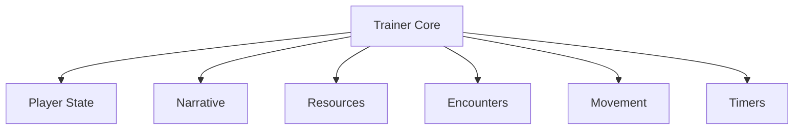

## Overview

Millennium Dream Trainer is a runtime gameplay control toolkit designed to interface directly with **Millennium Dream** and expose internal systems during active play. Operating entirely in memory, the trainer allows selective manipulation of player attributes, resource logic, encounter behavior, progression flags, and scripted events without modifying core files. Its modular structure supports sandbox testing, narrative branching exploration, and controlled gameplay variation through independently toggled systems.

---

## Player State and Condition Control

* Health and failure-state lock
* Damage and penalty negation
* Energy or stamina freeze
* Status effect immunity

**In-game behavior:**
Overrides player-condition evaluations to prevent loss states or enforce fixed values during interactions.

---

## Narrative and Progression Management

* Story flag activation
* Chapter and scene unlocks
* Choice outcome override
* Progress rollback toggle

**Feature intent:**
Provides direct control over narrative flow and progression markers stored in runtime memory.

---

## Resource and Inventory Systems

* Currency value editing
* Item quantity freeze
* Usage consumption bypass
* Requirement suppression

**In-game behavior:**
Adjusts inventory and resource tracking to ensure predictable behavior during progression and exploration.

---

## Encounter and Event Control

* Encounter enable/disable
* NPC behavior scaling
* Event trigger bypass
* Scripted sequence skip

**Feature intent:**
Allows controlled handling of encounters and scripted moments for testing or exploration.

---

## Movement and Exploration Adjustments

* Movement speed multiplier
* Jump or traversal scaling
* Gravity modification
* Collision disable (noclip)

**In-game behavior:**
Alters locomotion and traversal parameters to enable unrestricted exploration.

---

## Timing and Cooldown Overrides

* Action cooldown removal
* Event timer freeze
* Delay suppression
* Scripted wait skip

**Feature intent:**
Removes enforced timing constraints from abilities and narrative sequences.

---

## Runtime Trainer Interface Layer

* Hotkey-based feature toggles
* Modular subsystem activation
* Safe enable/disable handling
* Session-based configuration

**In-game behavior:**
Acts as the centralized control surface coordinating all trainer systems during gameplay.

---

---

## FAQ

**Does the trainer modify game files?**
No. All changes are applied in memory during runtime only.

**Can narrative choices be revisited?**
Yes. Progression and choice flags can be adjusted during a session.

**Are systems independent?**
Yes. Each subsystem can be enabled or disabled separately.

**Do changes persist between sessions?**
No. All values reset when the game is restarted.

**Can movement overrides affect scripted scenes?**
Only if traversal bypasses intended triggers.

---

## Feature Summary

* Player state and condition control
* Narrative and progression management
* Resource and inventory manipulation
* Encounter and event handling
* Movement and exploration adjustments
* Timing and cooldown overrides
* Centralized runtime trainer interface
